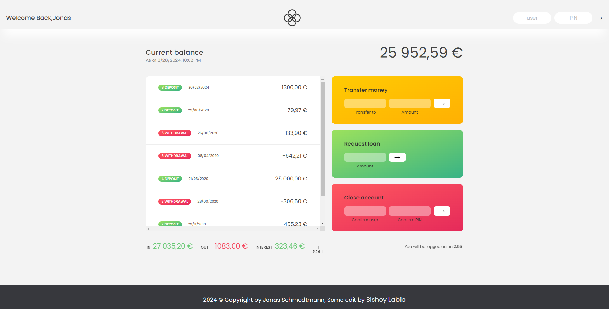

# 💵 Banskist

<h1 align="center">
    
</h1>

## What is Bankist?

Bankist is a fictional online bank. It is a project introduced by <a href="https://github.com/jonasschmedtmann">Jonas Schmedtmann</a>. It is an innovative and easy-to-use online banking platform. Integrating all the essential features of a real bank.

---

# Important
## :key: How to Login

User : js  
Password : 1111

User : jd  
Password : 2222

User : stw  
Password : 3333

User : ss  
Password : 4444

---

:key: Take a look --> https://bishoylabib7.github.io/Bankist/

## :rocket: Technologies used:

<a href="https://developer.mozilla.org/en-US/docs/Web/HTML" target="_blank" rel="noreferrer"> 

You can use any tools you like to help you complete the challenge. So if you've got something you'd like to practice, feel free to give it a go.

---

## About

this project was developed in The Complete JavaScript Course 2024: From Zero to Expert! 
https://www.udemy.com/course/the-complete-javascript-course/

Created by **<a href="https://github.com/jonasschmedtmann">Jonas Schmedtmann</a>**  
Developed by **<a href="https://github.com/BishoyLabib7">Bishoy Labib**
